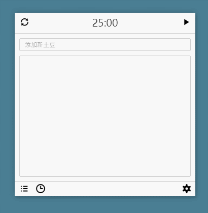

# Tomato-clock
> 基于`Angular`的 chrome webapp

## 安装与使用

由于这个应用没有上架Chrome应用商店，所以需要自行安装，步骤如下：

1. 在chrome浏览器打开`chrome://extensions/`网址
2. 选择开启开发者模式
3. 点击加载已解压的扩展程序，选择本项目的app文件夹
4. 点击启动即可

## 注意事项

本项目是出于学习目的的开发项目，如果觉得这个app很好用的话可以试试 [番茄土豆](https://pomotodo.com/) 这个软件

我的界面大多是仿照这个软件的

## 更新计划

- [ ] 迁移app至[Electron](http://www.cnblogs.com/lhb25/p/create-cross-platform-desktop-applications.html)平台